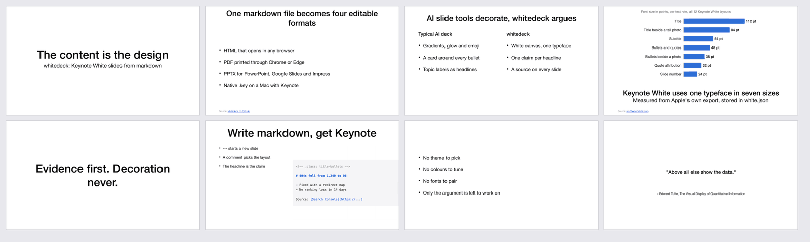
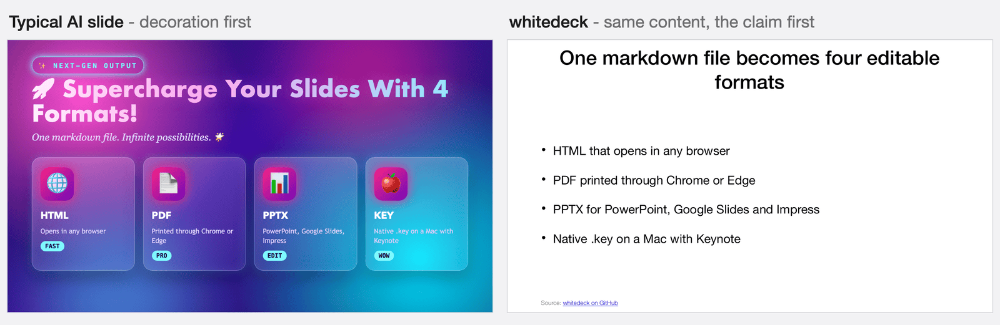
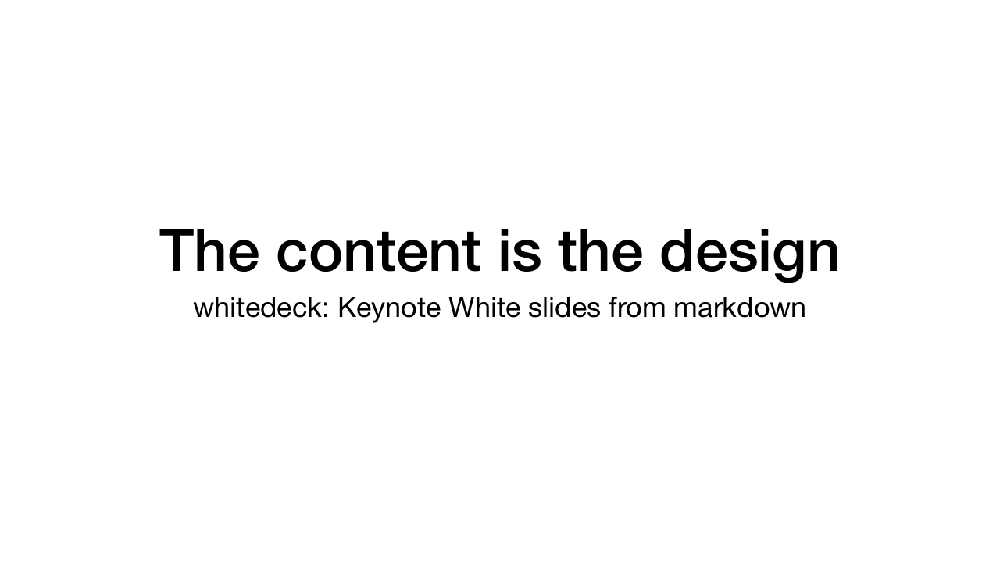
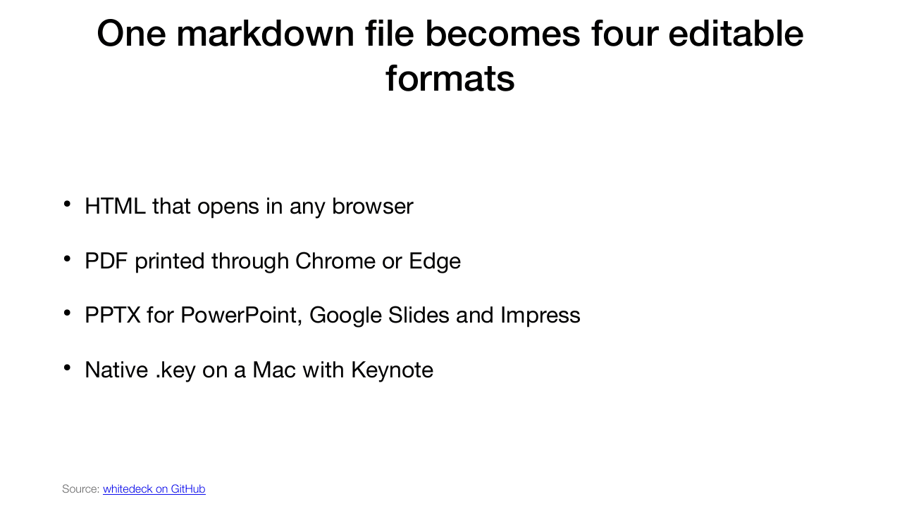
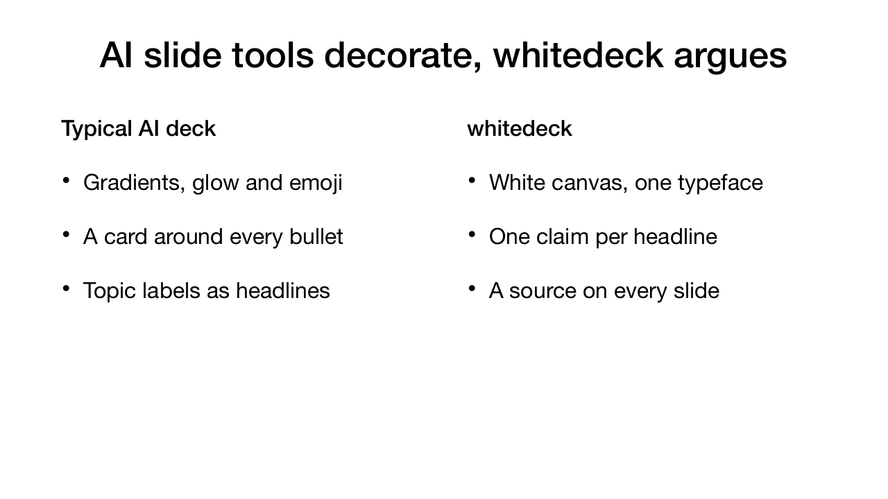
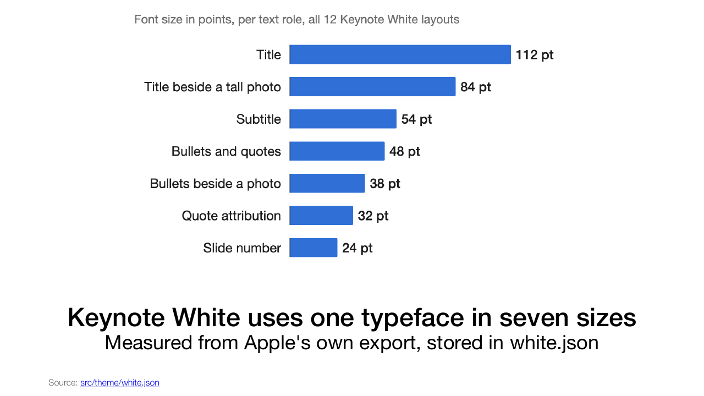
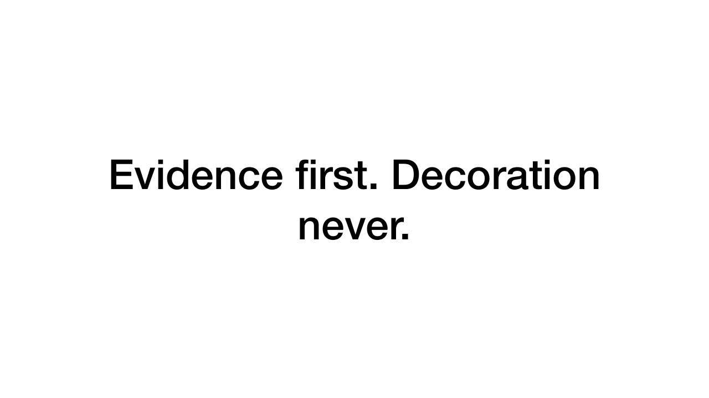
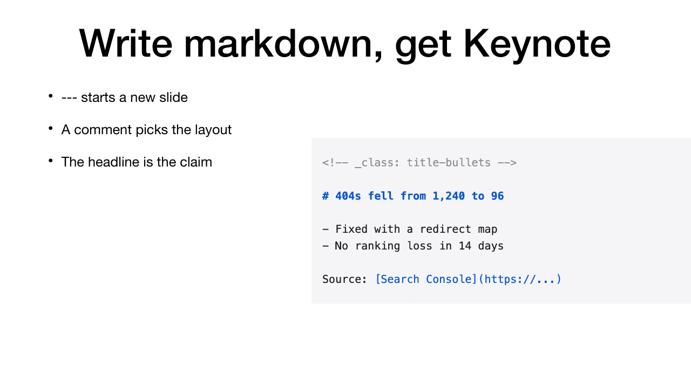
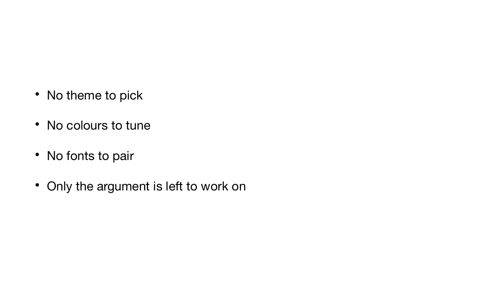
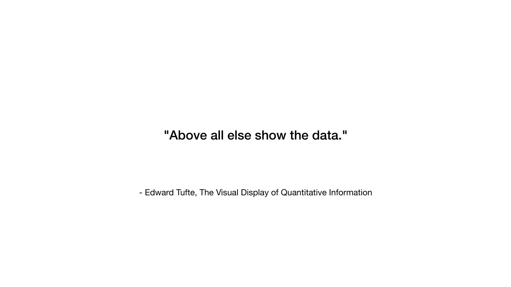

# whitedeck

[](https://github.com/franzenzenhofer/whitedeck/actions/workflows/ci.yml)


[](LICENSE)

**The content is the design.** whitedeck turns markdown into slides in Apple Keynote's plain
White theme: HTML, PDF, editable PPTX and native `.key`, with Apple's own layout geometry.
Built for Claude Code and other AI agents, so their decks stop looking like AI decks.



```bash
npm install -g https://github.com/franzenzenhofer/whitedeck/archive/refs/heads/main.tar.gz
whitedeck init my-deck.md
whitedeck build my-deck.md -f all
```

## Why

Ask an AI agent for slides and it decorates: gradients, glow, emoji for icons, a card around
every bullet, a headline that names a topic instead of making a point. It looks busy and says
little.

whitedeck takes all of that off the table. White canvas, one typeface, one claim per headline,
the evidence on the slide and its source underneath. There is nothing to fiddle with, so the only
thing left to improve is the argument. Pretty slides are a sign of the wrong priorities.



Same four facts on both slides. One wants to be admired, the other gets read.

Under the plain look sits **provably exact geometry**: every placeholder position, size, font and
point size is extracted from Apple's own Keynote export into one source of truth
(`src/theme/white.json`) and asserted by integration tests in every output format.

## Gallery

Every image below is a page of [`docs/showcase/showcase.md`](docs/showcase/showcase.md), rendered by
`whitedeck build showcase.md -f pdf`.

| | |
|---|---|
|  `title` |  `title-bullets` |
|  `compare` |  `photo-horizontal` |
|  `title-center` |  `title-bullets-photo` |
|  `bullets` |  `quote` |

## Output formats

| Format | Engine | Notes |
|--------|--------|-------|
| `html` | [Marp CLI](https://github.com/marp-team/marp-cli) + generated Keynote-exact CSS theme | self-contained file |
| `pdf`  | same render, printed via headless Chrome | one 16:9 page per slide |
| `pptx` | [PptxGenJS](https://github.com/gitbrent/PptxGenJS), native OOXML | fully **editable**, exact EMU geometry |
| `key`  | the pptx, imported and saved by the real Keynote.app, then reopened and checked | the verified pptx: clickable links, no theme dummy copy; the build throws on either (macOS only) |

## Install and platforms

whitedeck runs on macOS, Linux and Windows with Node.js 20 or newer. No Keynote and no
PowerPoint needed for anything but `.key`.

```bash
npm install -g https://github.com/franzenzenhofer/whitedeck/archive/refs/heads/main.tar.gz
whitedeck init my-deck.md
whitedeck build my-deck.md -f all
```

The commands are the same in Terminal, bash, PowerShell and cmd.

| format | needs | macOS | Linux | Windows |
|--------|-------|-------|-------|---------|
| `pptx` | nothing - PptxGenJS writes the file, no PowerPoint | yes | yes | yes |
| `html` | nothing - Marp renders it without a browser | yes | yes | yes |
| `pdf`  | a Chromium-family browser: Chrome, Chromium or Edge | yes | yes | yes, Edge ships with Windows |
| `key`  | Keynote.app (found by bundle id `com.apple.Keynote`) | yes | no | no |

**`-f all` builds every format this machine can build**: html + pdf + pptx (+ key on a Mac with
Keynote). Every format it leaves out gets one line on stderr, and the exit code stays 0:

```
skipped key: Keynote is macOS-only (this machine runs Linux). Fix: use -f pptx, which opens in PowerPoint, Keynote, LibreOffice Impress and Google Slides
```

**A format you name explicitly must be buildable**: `-f key` on Linux, or `-f pdf` without a
browser, stops before anything is written, exit 1, one line with the reason and the fix.

**Which browser prints the PDF**: `CHROME_PATH` if set (a wrong path is an error, not a
fallback), else the first one found among installed Chrome, Chromium and Edge (Windows: the
Program Files and LocalAppData install folders; Linux: `google-chrome`, `chromium`,
`microsoft-edge` on `PATH`, `/opt`, `/snap`; macOS: `/Applications` and `~/Applications`), else a
browser downloaded by `npx playwright install chromium` or `npx @puppeteer/browsers install chrome`.
No browser at all: install Chrome or Edge, or run `npx playwright install chromium`.

CI builds the examples with `-f all` on ubuntu, windows and macos runners on every push.

## Writing decks

Slides are separated by `---`. A comment picks one of the 12 Keynote White layouts;
without it, whitedeck infers a sensible one.

```markdown
---
title: My Deck
author: Me
---

<!-- _class: title -->
# Big Title
## Subtitle

---

<!-- _class: title-bullets -->
# Agenda
- First point
- Second point
  - Nested detail

---

<!-- _class: quote -->
> "Simplicity is the ultimate sophistication."
> -- Leonardo da Vinci

---

<!-- _class: photo-horizontal -->
# The ocean
## A caption


Source: [GSC Performance](https://search.google.com/search-console)

---

<!-- _class: compare -->
# New template loads 3x faster than old
- **Before**
- LCP 4.1s
- **After**
- LCP 1.3s
```

Links `[text](url)` render blue and underlined in every format (real hyperlinks in PPTX).
A final `Source: [Name](url)` line becomes a small source note at the bottom of the slide.
Titles that would overflow their box auto-shrink, exactly like Keynote.

List all layouts: `whitedeck layouts`

```
title            title-center     title-top        title-bullets
bullets          title-bullets-photo               photo
photo-horizontal photo-vertical   photo-3-up       quote            blank
compare          (virtual: side-by-side bullet columns on Keynote geometry)
title-left       section-left     title-bullets-left   (left-aligned at a 54pt margin)
scope-shot       scope-compare    scope-shot-notes     (annotated screenshot slides)
```

Annotated screenshot slides carry a `Scope:` header line, a `Tool:` logo, bordered
screenshots (``), a notes column and a `Caption:` link;
`logo: x.png` in the front matter paints a logo on every slide; `**bold**` and `[x]{#1db100}`
colour runs survive into PPTX and Keynote. See `examples/scope-demo.md` and the skill.

## CLI

```bash
whitedeck build deck.md -f html,pdf,pptx -o out/   # render formats
whitedeck build - -f pptx < deck.md                # stdin
whitedeck build deck.md -o out/board-q3.pptx       # exact file, format from the extension
whitedeck build deck.md -f all --name board-q3     # explicit base name
whitedeck layouts --json                           # machine-readable layout list
whitedeck validate deck.md                         # JSON report, exit 1 on errors
whitedeck init [name]                              # scaffold an example deck
```

### Output file names

Outputs are named after the **deck**, not after the input file: the front-matter `title`
(or, without one, the first headline) becomes a slug.

```
---
title: Q3 Revenue Review
---
```

→ `q3-revenue-review.html`, `q3-revenue-review.pdf`, `q3-revenue-review.pptx`,
`q3-revenue-review.key` - whatever the markdown file or the stdin pipe was called.
Umlauts transliterate (`Über Größe` → `ueber-groesse`), slugs are capped at 60 characters
on a word boundary. Override with `--name <base>` or `-o <dir>/<file>.<format>`. A deck with
no title and no input file name (stdin) is an error, not a file called `deck`.

## For AI agents

- **Claude skill**: `skills/whitedeck/SKILL.md` ships with the package - including the
  editorial persona (assertion headlines, max 5 bullets, one chart per slide, everything
  linked to its data source).
- **MCP server**: `whitedeck-mcp` (stdio) exposes `whitedeck_build`, `whitedeck_layouts`,
  `whitedeck_validate`. `whitedeck_build` follows the same format rules as the CLI and reports
  `built` and `skipped` (format, reason, fix):

```bash
claude mcp add whitedeck -- whitedeck-mcp
```

## Development

TDD red-to-green, 100% integration tested, zero mocks - tests drive the real Marp, real Chrome,
real Keynote.app and a real MCP stdio client:

```bash
npm install
npm run gates    # typecheck, lint, test, build
npm run smoke    # build every example with -f all on this OS
```

## License

MIT (c) 2026 Franz Enzenhofer

Not affiliated with or endorsed by Apple Inc. Keynote is a trademark of Apple Inc. whitedeck
contains no Apple assets - only independently measured layout geometry.
