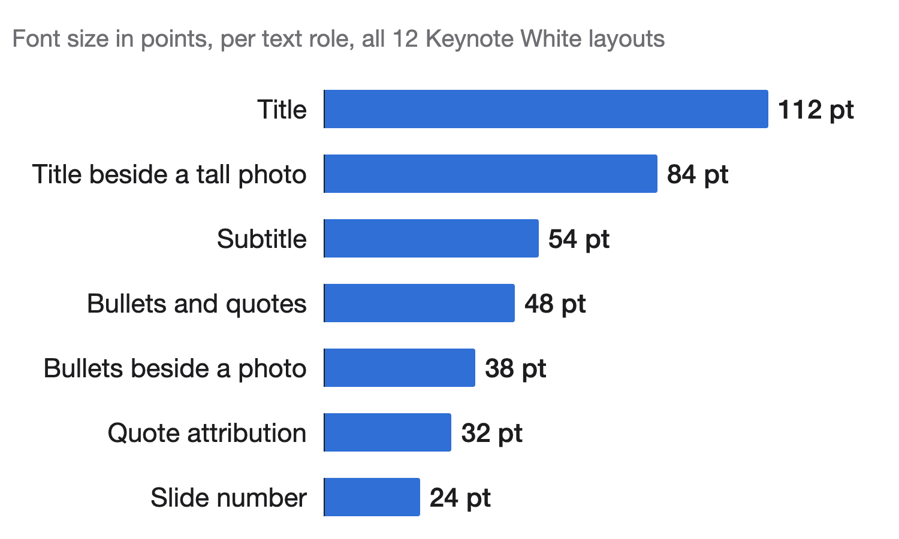
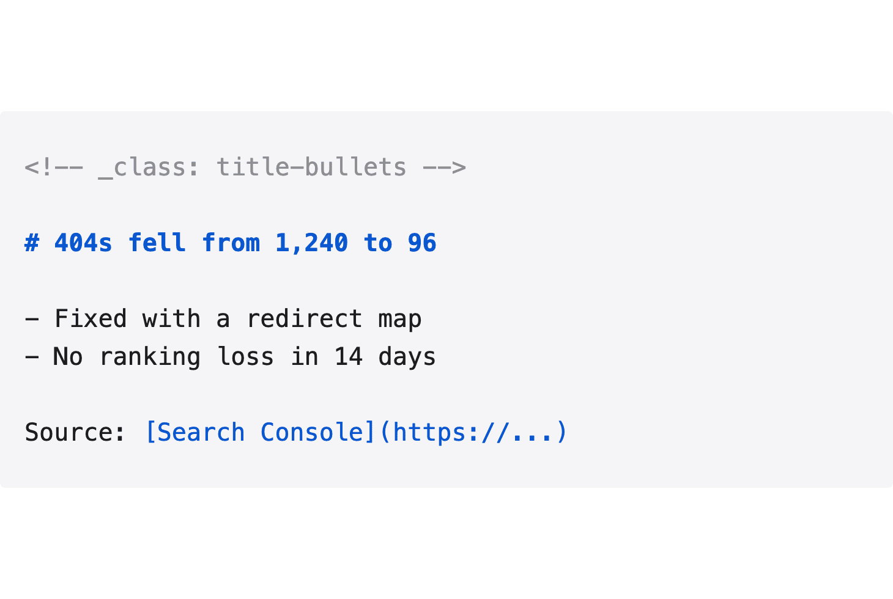

<!-- _class: title -->

# The content is the design

## whitedeck: Keynote White slides from markdown

---

<!-- _class: title-bullets -->

# One markdown file becomes four editable formats

- HTML that opens in any browser
- PDF printed through Chrome or Edge
- PPTX for PowerPoint, Google Slides and Impress
- Native .key on a Mac with Keynote

Source: [whitedeck on GitHub](https://github.com/franzenzenhofer/whitedeck)

---

<!-- _class: compare -->

# AI slide tools decorate, whitedeck argues

- **Typical AI deck**
- Gradients, glow and emoji
- A card around every bullet
- Topic labels as headlines
- **whitedeck**
- White canvas, one typeface
- One claim per headline
- A source on every slide

---

<!-- _class: photo-horizontal -->

# Keynote White uses one typeface in seven sizes

## Measured from Apple's own export, stored in white.json

Source: [src/theme/white.json](https://github.com/franzenzenhofer/whitedeck/blob/main/src/theme/white.json)

---

<!-- _class: title-center -->

# Evidence first. Decoration never.

---

<!-- _class: title-bullets-photo -->

# Write markdown, get Keynote

- `---` starts a new slide
- A comment picks the layout
- The headline is the claim

---

<!-- _class: bullets -->

- No theme to pick
- No colours to tune
- No fonts to pair
- Only the argument is left to work on

---

<!-- _class: quote -->

> "Above all else show the data."
> -- Edward Tufte, The Visual Display of Quantitative Information
